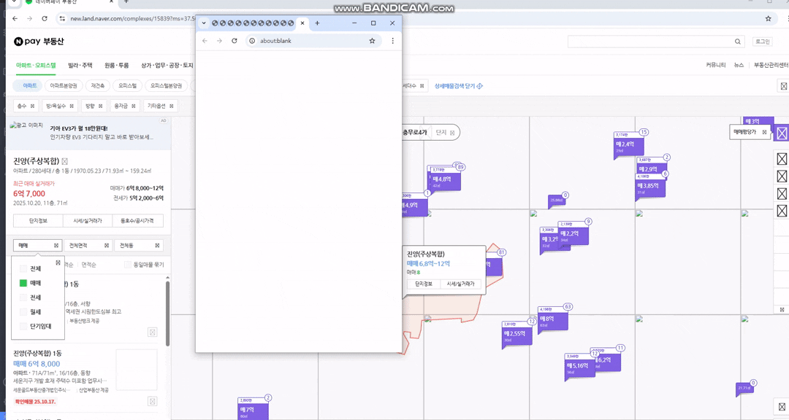

# anti_bot_scraper

[English](./README.md) | 한국어

Naver 부동산 스크래퍼. anti-bot 우회 + 갭투자 매물 자동 필터링.

[](https://www.python.org/)
[](https://playwright.dev/)
[](LICENSE)

---

## 데모

<div align="center">
  
</div>

---

## 목차

- [주요 기능](#주요-기능)
- [설치 방법](#설치-방법)
- [사용법](#사용법)
- [설정 상세](#설정-상세)
- [출력 결과](#출력-결과)
- [기술 상세](#기술-상세)
- [갭투자 분석](#갭투자-분석)
- [주의사항](#주의사항)

---

## 주요 기능

### Anti-Bot 우회

Naver 봇 탐지 우회용:

- 맵 네비게이션: 랜덤 줌 레벨 + 드래그
- 마우스 이동: 20단계로 부드럽게 이동
- 그리드 스윕: 위/아래 행만 스캔해서 패턴 숨김
- 리소스 차단: 이미지/폰트 차단으로 빠른 로딩

최근 Naver 업데이트로 기존 스크래퍼 대부분 차단됨. 교육 목적으로 직접 구현.

### 데이터 수집

- 아파트(APT), 빌라/연립/다세대(VL) 매물
- 중개사 상호, 이름, 연락처 (전화 2개)
- 과거 전세가 (최고가/최저가)
- 매물 상세 (층수, 면적, 방향, 특징)
- 실시간 등록 매물

### 갭투자 분석

기전세금이 매매가보다 높거나 비슷한 매물 자동 필터링.

```
갭금액 = 매매가 - 기전세금
갭비율 = 갭금액 / 매매가

예시: 매매 3억, 기전세 2.9억 → 갭 1,000만원 (3.3%)
```

### 처리

- 12 워커 병렬 수집
- 1회 실행 10,000+ 매물
- 지리 그리드 기반
- asyncio 비동기

---

## 설치 방법

### 1. 요구사항

- Python 3.9+
- 인터넷 연결
- RAM 2GB+ (12 워커 기준)

### 2. 의존성 설치

```bash
# 패키지 설치
pip install playwright pandas openpyxl

# Playwright 브라우저 설치
playwright install chromium
```

### 3. 코드 다운로드

```bash
git clone https://github.com/HarimxChoi/naver-estate-scraper.git
cd naver-estate-scraper
```

---

## 사용법

### 기본 사용

```bash
python realEstate.py
```

실행 시 입력 프롬프트:

```
위도 (기본: 37.5608): 37.5608
경도 (기본: 126.9888): 126.9888
줌 (기본: 14): 14
```

좌표 찾는 법:
1. [Naver 지도](https://map.naver.com) 접속
2. 지역 검색
3. 우클릭 > "이 장소의 URL 복사"
4. URL의 `?lng=126.9888&lat=37.5608` 부분 확인

### 실행 예시

강남역 주변 수집:

```
위도: 37.4979
경도: 127.0276
줌: 15
```

여의도 주변 수집:

```
위도: 37.5219
경도: 126.9245
줌: 16
```

### 실행 과정

```
1. Naver 부동산 맵 접속
2. 맵 중심 이동
3. 그리드 패턴 스윕
4. 단지 정보 수집 (수백~수천)
5. 매물 많은 단지 우선 방문
6. 매물 상세 수집 (12개 동시)
7. 엑셀 저장
```

실행 시간: 줌 레벨/지역에 따라 1~7분.

---

## 설정 상세

코드 상단의 설정값으로 동작 조정 가능.

### 지리 범위

```python
KOR_BOUNDS = (33.0, 39.5, 124.0, 132.1)
# (최소위도, 최대위도, 최소경도, 최대경도)
```

스크래퍼가 한국 영토 밖으로 나가지 않도록 제한.
- 제주도: 33.0 (최남단)
- 강원도 북부: 39.5 (최북단)
- 서해안: 124.0 (최서단)
- 동해안: 132.1 (최동단)

기본값으로 한국 전역 커버. 수정 불필요.

---

### 수집 규모

```python
MAX_COMPLEX_DETAIL = 800
```

상세 페이지 진입 단지 수 상한.
- 단지당 1초 미만
- 800개 = 약 10분

추천:
- 테스트: `100`
- 일반: `500-800`
- 전체: `2000+`

```python
MAX_ARTICLE_DETAIL = 10000
```

매물 상세 파싱 상한.
- 매물당 1~3초 (12 워커 기준)
- 10,000개 = 4~6분

추천:
- 테스트: `100`
- 소규모: `1000-3000`
- 대규모: `10000+`

---

### 필터링

```python
ONLY_WITH_PREV_JEONSE = True
```

`True`면 과거 전세 기록 있는 매물만 수집. 갭투자 분석에 필요.

```python
ONLY_PREV_GT_SALE = True
```

`True`면 기전세금 >= 매매가인 매물만 결과에 포함. 결과 크게 줄어듦 (수만 → 수십~수백).

추천:
- 갭투자: `True`
- 시장 조사: `False`

```python
MIN_LISTING_COUNT = 2
```

단지별 최소 매물 개수. 이 값 미만 단지는 우선순위 낮음.

```python
PRIORITIZE_BY_COUNT = False
```

`True`면 매물 많은 단지부터 우선 방문.

---

### 성능

```python
DETAIL_WORKERS = 12
```

매물 상세 동시 수집 브라우저 탭 수. 각 워커는 독립 탭. 많을수록 빠르지만 메모리/네트워크 부담.

추천:
- 저사양: `4-6`
- 일반: `8-12`
- 고사양: `16-20`

너무 많으면 IP 차단 위험 커짐.

```python
BLOCK_HEAVY_RESOURCES = True
```

이미지, 폰트, 미디어 차단.
- `True`: 2~3배 빠른 로딩
- `False`: 모든 리소스 로드

추천: `True` (봇 탐지에도 문제없음).

---

### 수집 전략

```python
GRID_RINGS = 1
```

중심 좌표 기준 바깥 고리 수.
- `RINGS=1`: 8~12개 지점
- `RINGS=2`: 24~32개 지점

추천:
- 구 단위: `1`
- 시 단위: `2-3`

```python
GRID_STEP_PX = 480
```

그리드 지점 간 간격(픽셀). 작을수록 촘촘함.

추천:
- 촘촘: `360-400`
- 일반: `480-520`
- 빠름: `600+`

```python
SWEEP_DWELL = 0.6
```

각 지점에서 머무르는 시간(초). 이 동안 API 응답 수집. 너무 짧으면 응답 놓침.

추천: `0.5-0.8`.

---

### 줌 레벨

```python
ZOOM_MIN, ZOOM_MAX = 15, 17
```

허용 줌 레벨 범위.
- 줌 15: 구 단위
- 줌 17: 동네 단위

---

### 자산 유형

```python
ASSET_TYPES = "APT:VL"
```

수집할 부동산 유형.

- `"APT"`: 아파트
- `"VL"`: 빌라/연립/다세대
- `"APT:VL"`: 둘 다

API 엔드포인트:
- `APT` > `/complexes`
- `VL` > `/houses`

---

### 모바일 페이지

```python
USE_MOBILE_DETAIL = True
```

매물 상세 가져올 때 모바일 페이지 사용 여부.
- `True`: `m.land.naver.com` (가볍고 빠름)
- `False`: 데스크톱

추천: `True`.

---

### 설정 예시

#### 예시 1: 빠른 테스트

```python
MAX_COMPLEX_DETAIL = 50
MAX_ARTICLE_DETAIL = 100
DETAIL_WORKERS = 8
GRID_RINGS = 1
ONLY_PREV_GT_SALE = True
```

#### 예시 2: 표준 수집

```python
MAX_COMPLEX_DETAIL = 500
MAX_ARTICLE_DETAIL = 5000
DETAIL_WORKERS = 12
GRID_RINGS = 1
ONLY_PREV_GT_SALE = True
```

#### 예시 3: 전체 수집

```python
MAX_COMPLEX_DETAIL = 2000
MAX_ARTICLE_DETAIL = 20000
DETAIL_WORKERS = 16
GRID_RINGS = 2
ONLY_PREV_GT_SALE = False  # 모든 매물
```

---

## 출력 결과

### 엑셀 파일

실행 완료 시 `매물정보_확장_YYYYMMDD_HHMMSS.xlsx` 생성.

### 컬럼 설명

| 컬럼명 | 설명 | 예시 |
|--------|------|------|
| 매물명 | 아파트/빌라 이름 | 래미안강남힐스테이트 |
| 매물번호 | Naver 매물 고유 번호 | 2444012345 |
| 거래유형 | 매매/전세/월세 | 매매 |
| 매매 금액(원) | 매매가 (원 단위) | 380000000 |
| 층수 | 층 정보 | 15/25 |
| 면적(㎡) | 공급면적 | 84.93 |
| 전용면적 | 전용면적 | 59.92 |
| 방향 | 향 | 남동 |
| 특징 | 매물 특징 | 풀옵션, 역세권 |
| 등록일 | 매물 등록일 | 20240115 |
| 부동산상호 | 중개사 상호 | 강남부동산 |
| 중개사이름 | 중개사 이름 | 홍길동 |
| 전화1 | 중개사 연락처 1 | 02-1234-5678 |
| 전화2 | 중개사 연락처 2 | 010-1234-5678 |
| 전세_기간(년) | 전세 데이터 기간 | 3 |
| 전세_기간내_최고(원) | 기간 내 최고 전세가 | 350000000 |
| 전세_기간내_최저(원) | 기간 내 최저 전세가 | 320000000 |
| 기전세금(원) | 직전 전세가 | 340000000 |
| 갭금액(원) | 매매가 - 기전세금 | 40000000 |
| 갭비율 | 갭금액 / 매매가 | 0.1053 (10.53%) |

### 결과 예시

```
매물명: 래미안강남힐스테이트
매매 금액: 380,000,000원 (3억 8천만원)
기전세금: 340,000,000원 (3억 4천만원)
갭금액: 40,000,000원 (4천만원)
갭비율: 10.53%

> 전세 3.4억 놓고 본인 돈 4천만원으로 구매 가능.
```

---

## 기술 상세

### Anti-Bot 우회 메커니즘

#### 1. 인간형 맵 네비게이션

```python
async def human_like_recenter(page, lat, lon, zoom):
    rand_out = random.randint(9, 12)  # 랜덤 줌 아웃
    await wheel_to_zoom(page, rand_out)
    await drag_to_latlon(page, lat, lon)
    await wheel_to_zoom(page, zoom)
    await drag_to_latlon(page, lat, lon)
```

목표 위치로 직행하지 않고 줌 아웃 > 이동 > 줌 인 > 미세조정 순서.

#### 2. 마우스 이동 시뮬레이션

```python
await page.mouse.move(960 - mx, 540 - my, steps=20)
```

한 번에 점프하지 않고 20단계 베지어 곡선.

#### 3. 그리드 스윕

```python
# 상하(Top/Bottom) 행만 스캔
for r in range(1, rings + 1):
    for dx in range(-r, r + 1):
        for dy in (-r, r):  # Top, bottom rows only
```

전체 그리드 순회 대신 위/아래 행만 스캔해서 패턴 숨김.

#### 4. 변칙 타이밍

```python
await asyncio.sleep(0.6)  # 고정값 아님, 코드 여러 곳에 분산
```

동작 사이 딜레이 분산 배치.

---

### 지리 알고리즘

#### Mercator Projection

```python
def ll_to_pixel(lat: float, lon: float, z: float):
    scale = 256 * (2 ** z)
    x = (lon + 180.0) / 360.0 * scale
    siny = math.sin(math.radians(lat))
    y = (0.5 - math.log((1 + siny) / (1 - siny)) / (4 * math.pi)) * scale
    return x, y
```

위도/경도 > 픽셀 좌표 변환. 정확한 맵 드래그용.

역변환:

```python
def pixel_to_ll(x: float, y: float, z: float):
    scale = 256 * (2 ** z)
    lon = x / scale * 360.0 - 180.0
    n = math.pi - 2.0 * math.pi * y / scale
    lat = math.degrees(math.atan(math.sinh(n)))
    return lat, lon
```

### 동시 처리

```python
# 12 워커 풀
page_q = asyncio.Queue()
for _ in range(DETAIL_WORKERS):
    dp = await mctx.new_page()
    await page_q.put(dp)

# 작업 분배
tasks = [asyncio.create_task(fetch_one(a)) for a in article_list]

# 탭 재사용
dp = await page_q.get()
try:
    result = await scrape_article_detail(dp, article_no)
finally:
    await page_q.put(dp)
```

탭 재사용으로 메모리 절약. 10,000 매물을 15~30분 내 처리.

## 주의사항

교육 및 연구 목적의 참고 구현.

#### 1. Naver 이용약관

- [Naver 이용약관](https://policy.naver.com/rules/service.html) 숙지
- 과도한 요청 금지
- 적절한 딜레이 (현재 코드는 안전한 수준)

#### 2. 개인정보

- 수집한 중개사 연락처는 본인의 부동산 거래 목적으로만 사용
- 제3자 판매, 스팸 발송 금지
- 개인정보보호법 준수

#### 3. 데이터 사용

- 상업적 재판매 금지
- Naver와 경쟁 서비스 제공 금지

#### 4. 책임

- 부적절한 사용으로 발생하는 법적 문제는 사용자 책임
- Naver 플랫폼 변경으로 작동 안 할 수 있음
- 데이터 정확성 보장 안 함

### 기술적 제한

- Naver는 언제든 플랫폼 구조 변경 가능
- IP 차단 위험. 적절한 간격으로 실행
- 공용 IP에서 다수 동시 실행 시 차단 위험

코드 기준: 2025년 10월.

---

## 라이선스

MIT License. Copyright (c) 2024 Harim Choi.
